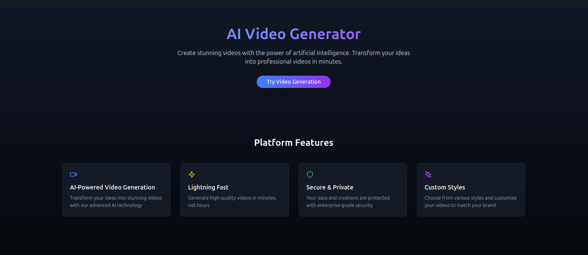

# AI Video Generator

A modern web application that leverages artificial intelligence to generate videos from text descriptions. Built with React, TypeScript, and Firebase, featuring a sleek UI with Tailwind CSS and Framer Motion animations.

## Features

- **AI-Powered Video Generation**: Transform text descriptions into high-quality videos
- **Real-time Chat Interface**: Interactive chat-like interface for video generation
- **Authentication**: Secure user authentication with Firebase (Email/Password and Google Sign-in)
- **Responsive Design**: Beautiful, mobile-first UI that works across all devices
- **Modern Animation**: Smooth transitions and animations using Framer Motion
- **Dark Mode**: Built-in dark mode support for better user experience

## ⚠️ TODO

### Critical Tasks
1. **API Integration**
   - Integrate with a video generation AI API (e.g., Replicate, RunwayML)
   - Implement proper error handling for API responses
   - Add rate limiting and usage tracking

2. **Firebase Implementation**
   - Set up Firebase Realtime Database rules
   - Implement user profile management
   - Add video history tracking
   - Set up Firebase Storage for video uploads

3. **Authentication**
   - Add password reset functionality
   - Implement email verification
   - Add OAuth providers (Twitter, GitHub)
   - Set up protected routes properly

4. **Features to Add**
   - Video customization options
   - Save/favorite videos functionality
   - Share generated videos
   - User dashboard
   - Video generation history

### Bug Fixes
1. **Authentication Flow**
   - Fix redirect after login
   - Implement proper session management
   - Handle authentication errors better

2. **UI/UX Improvements**
   - Add loading states for all actions
   - Implement proper error messages
   - Add input validation feedback
   - Improve mobile responsiveness

3. **Performance**
   - Implement proper code splitting
   - Add caching for generated videos
   - Optimize image and asset loading

### Technical Debt
1. **Testing**
   - Add unit tests for components
   - Implement integration tests
   - Add end-to-end testing

2. **Code Quality**
   - Implement proper TypeScript types
   - Add proper documentation
   - Set up proper logging
   - Implement error boundary components

## Getting Started

### Prerequisites

- Node.js (v18 or higher)
- npm or yarn
- Firebase account

### Installation

1. Clone the repository:
```bash
git clone https://github.com/gurugorule/t2v.git
cd t2v
```

2. Install dependencies:
```bash
npm install
```

3. Create a `.env` file in the root directory and add your Firebase configuration:
```env
VITE_API_KEY=your-api-key
VITE_AUTH_DOMAIN=your-auth-domain
VITE_PROJECT_ID=your-project-id
VITE_STORAGE_BUCKET=your-storage-bucket
VITE_MESSAGING_SENDER_ID=your-messaging-sender-id
VITE_APP_ID=your-app-id
```

4. Start the development server:
```bash
npm run dev
```

## Project Structure

```
src/
├── components/        # Reusable UI components
├── config/           # Configuration files
├── hooks/            # Custom React hooks
├── pages/            # Page components
├── services/         # API and service functions
├── store/            # State management (Zustand)
├── styles/           # Global styles and animations
├── types/            # TypeScript type definitions
└── utils/            # Utility functions
```

## Built With

- [React](https://reactjs.org/) - Frontend framework
- [TypeScript](https://www.typescriptlang.org/) - Type safety
- [Vite](https://vitejs.dev/) - Build tool
- [Firebase](https://firebase.google.com/) - Authentication & Backend
- [Tailwind CSS](https://tailwindcss.com/) - Styling
- [Framer Motion](https://www.framer.com/motion/) - Animations
- [Zustand](https://zustand-demo.pmnd.rs/) - State management

## Security

- Firebase Authentication for secure user management
- Environment variables for sensitive data
- Input validation and sanitization
- Protected routes for authenticated users

## Deployment

The application can be deployed using various platforms:

1. Build the project:
```bash
npm run build
```

2. Deploy to your preferred hosting platform (e.g., Netlify, Vercel, Firebase Hosting)

## Contributing

1. Fork the repository
2. Create your feature branch (`git checkout -b feature/NewFeature`)
3. Commit your changes (`git commit -m 'Add some NewFeature'`)
4. Push to the branch (`git push origin feature/NewFeature`)
5. Open a Pull Request


## 🙏 Acknowledgments

- [Lucide Icons](https://lucide.dev/) for beautiful icons
- [Radix UI](https://www.radix-ui.com/) for accessible UI components
- [Tailwind CSS](https://tailwindcss.com/) for utility-first CSS framework
