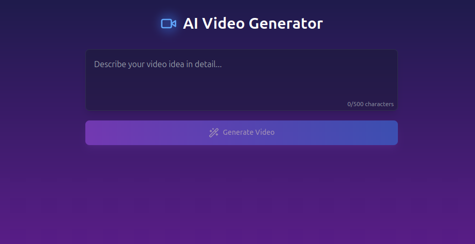

## Setup and Run the Project

### 1. **Install Dependencies**

```bash
npm install
```

### 2. **Run the Development Server**

```bash
npm run dev
```

---

## Docker Support

This web app can now be easily run using Docker.

### **1. Pull the Docker Image**

First, pull the image from Docker Hub:

```bash
docker pull gurugorule/t2v:latest
```

### **2. Run the Container**

After pulling the image, run the Docker container with the following command:

```bash
docker run --name t2v -p 3000:3000 -d gurugorule/t2v:latest
```

- **`--name t2v`**: Specifies the container name.
- **`-p 3000:3000`**: Maps port `3000` inside the container to port `3000` on your host.
- **`-d`**: Runs the container in detached mode (in the background).

You can now access the app at `http://localhost:3000`.

---

## TODO
- Text to Video API
- Rework Frontend
